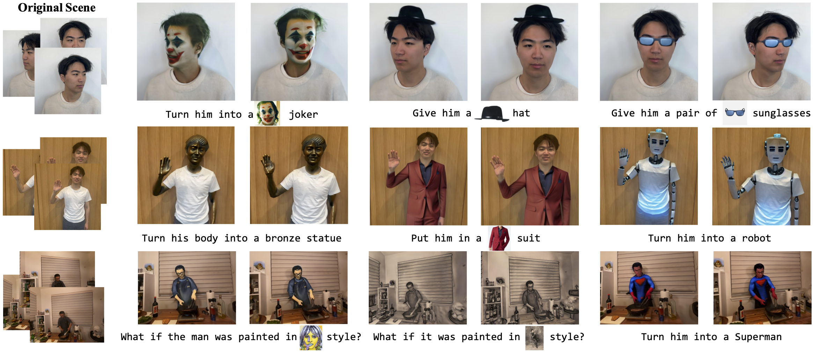

# CTRL-D: Controllable Dynamic 3D Scene Editing with Personalized 2D Diffusion

This repo is the official implementation for _CTRL-D: Controllable Dynamic 3D Scene Editing with Personalized 2D Diffusion_.

**[Kai He](http://academic.hekai.site/), [Chin-Hsuan Wu](https://chinhsuanwu.github.io/), [Igor Gilitschenski](https://tisl.cs.toronto.edu/author/igor-gilitschenski/).**

**[[Project Page]](https://ihe-kaii.github.io/CTRL-D/)**

## Abstract

Recent advances in 3D representations, such as Neural Radiance Fields and 3D Gaussian Splatting, have greatly improved realistic scene modeling and novel-view synthesis. However, achieving controllable and consistent editing in dynamic 3D scenes remains a significant challenge. Previous work is largely constrained by its editing backbones, resulting in inconsistent edits and limited controllability. In our work, we introduce a novel framework that first fine-tunes the InstructPix2Pix model, followed by a two-stage optimization of the scene based on deformable 3D Gaussians. Our fine-tuning enables the model to "learn" the editing ability from a single edited reference image, transforming the complex task of dynamic scene editing into a simple 2D image editing process. By directly learning editing regions and styles from the reference, our approach enables consistent and precise local edits without the need for tracking desired editing regions, effectively addressing key challenges in dynamic scene editing. Then, our two-stage optimization progressively edits the trained dynamic scene, using a designed edited image buffer to accelerate convergence and improve temporal consistency. Compared to state-of-the-art methods, our approach offers more flexible and controllable local scene editing, achieving high-quality and consistent results.
